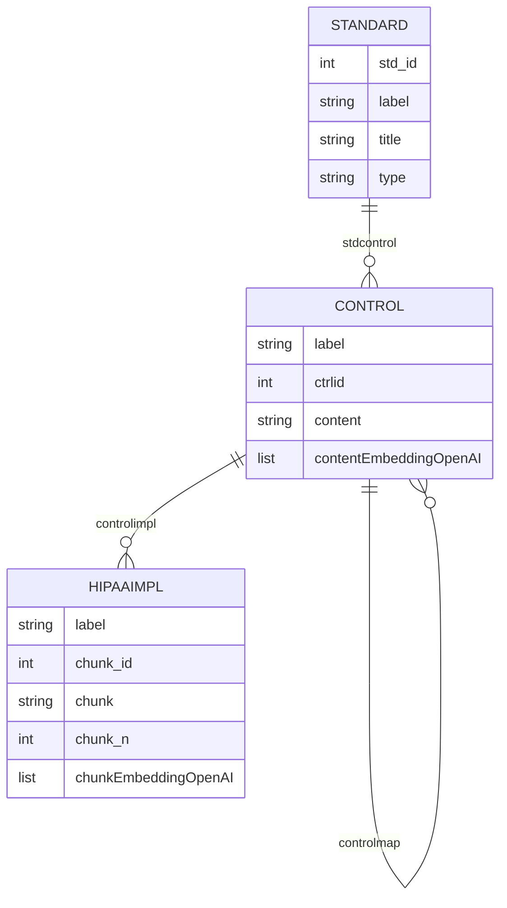

## CYBER-MAPPING-KG

A Knowledge Graph (KG) Proof-of-Concept for Cybersecurity and Privacy Standards, enabling SME-driven, agentic Reasoning and Retrieval-Augmented Generation (RAG) workflows.

---

### Overview

This project demonstrates how a standards-centric Knowledge Graph can power advanced inference and mapping tasks using both direct LLM (Language Model) and RAG-based approaches. The KG encodes controls, mappings, and embeddings for multiple cybersecurity and privacy frameworks, supporting agentic task chains for mapping, triage, and knowledge grounding.

---

### Supported Standards

The KG currently includes controls and mappings for:

| std_id | label           | title                  | type  |
|--------|-----------------|------------------------|-------|
| 10     | CIS_v8.0        | CIS Controls v8.0      | ref   |
| 20     | CSF_v1.1        | CSF v1.1               | focal |
| 30     | CSF_v2.0        | CSF v2.0               | focal |
| 40     | HIPAA_Sec-v2025 | HIPAA Security Rule    | hipaa |
| 50     | SCF_v2024       | SCF v2024.4            | ref   |

---

### Knowledge Graph Schema

The KG schema is designed to capture standards, controls, control mappings, and implementation details, including content vectors and open-ai chunk/content embeddings for semantic search.

> [!NOTE]
>
> #### Schema
>
> **Node properties**:
>
> standard {std_id: INTEGER, label: STRING, title: STRING, type: STRING}
>
> control {label: STRING, ctrlid: INTEGER, content: STRING, contentEmbeddingOpenAI: LIST}
>
> hipaaimpl {label: STRING, chunk_id: INTEGER, chunk: STRING, chunk_n: INTEGER, contentEmbeddingOpenAI: LIST}
>
> **Relationship properties**:
>
> stdcontrol {from_id: INTEGER, to_id: INTEGER}
>
> controlmap {from_id: INTEGER, to_id: INTEGER, concept_type: INTEGER, ref: STRING, hipaa: BOOLEAN, set_type: STRING}
>
> controlimpl {from_id: INTEGER, to_id: INTEGER}
>
> **The relationships**:
>
> (:standard)-[:stdcontrol]->(:control)
>
> (:control)-[:controlmap]->(:control)
>
> (:control)-[:controlimpl]->(:hipaaimpl)
>
> #### Data Location: 
>
> [Neo4J Nodes & Edges](./data/graphdb) 

------

### Agentic RAG & Inference Capabilities

The system supports the following agentic tasks:

- **Direct LLM Inference**: Uses a prompt template and LLM to answer mapping queries without retrieval augmentation.
- **RAG (Retrieval-Augmented Generation)**: Combines semantic search over KG embeddings with LLM reasoning for grounded, context-rich answers.
- **Triage & Grounding**: Compares generated mappings with grounded knowledge from the KG, supporting SME review and validation.

------

### Example CLI Usage

You can run different inference modes via the command line:

`python [main.py](http://_vscodecontentref_/0) demo --chat`

`python [main.py](http://_vscodecontentref_/1) demo --plain`

`python [main.py](http://_vscodecontentref_/2) demo --rag`

`python [main.py](http://_vscodecontentref_/3) demo --triage`

------

### Example Outputs

##### 1. Direct LLM (`--chat`)

Focal_Document_Element,Reference_Document_Element,Strength_of_relationship,Rationale

"GV.OC-01","164.308(a)(1)(ii)(A)",0.85,"Crosswalk-CSF 1.1 to HIPAA Security Rule"

##### 2. RAG Baseline (`--plain`)

Focal_Document_Element,Reference_Document_Element,Strength_of_relationship,Rationale

"GV.OC-01","164.308(a)(1)(ii)(A)",0.90,"Semantic match from KG embeddings"

"GV.OC-01","164.308(a)(1)(ii)(B)",0.80,"Semantic match from KG embeddings"

##### 3. Augmented RAG (`--rag`)

Focal_Document_Element,Reference_Document_Element,Strength_of_relationship,Rationale

"GV.OC-01","164.308(a)(1)(ii)(A)",0.92,"Grounded mapping from KG and LLM"

"GV.OC-01","164.308(a)(1)(ii)(B)",0.87,"Grounded mapping from KG and LLM"

##### 4. Triage (`--triage`)

Focal_Document_Element,Reference_Document_Element,Strength_of_relationship,Rationale,Agreement

"GV.OC-01","164.308(a)(1)(ii)(A)",0.92,"Grounded from KB inference; LLM generated",Yes

"GV.OC-01","164.308(a)(1)(ii)(B)",0.87,"Grounded from KB inference",No

------

Focal_Document_Element,Reference_Document_Element,Strength_of_relationship,Rationale,Agreement

"GV.OC-01","164.308(a)(1)(ii)(A)",0.92,"Grounded from KB inference; LLM generated",Yes

"GV.OC-01","164.308(a)(1)(ii)(B)",0.87,"Grounded from KB inference",No

------

### Extending the KG

To add new standards or mappings, update the CSVs in `data/graphdb/` and re-run the preprocessing pipeline:

`python main.py prep --reload`

------

### References

- NIST CSF 2.0, HIPAA Security Rule, CIS Controls, Secure Controls Framework (SCF)
- [LangChain](vscode-file://vscode-app/c:/Users/seedl/AppData/Local/Programs/Microsoft VS Code/resources/app/out/vs/code/electron-sandbox/workbench/workbench.html), [Neo4j](vscode-file://vscode-app/c:/Users/seedl/AppData/Local/Programs/Microsoft VS Code/resources/app/out/vs/code/electron-sandbox/workbench/workbench.html)

