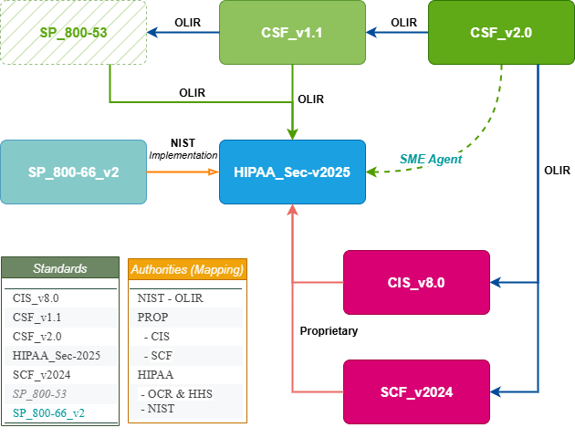
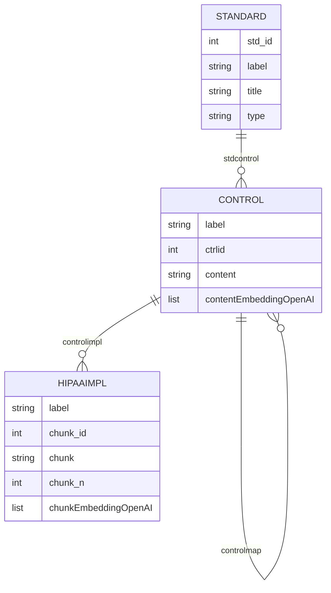
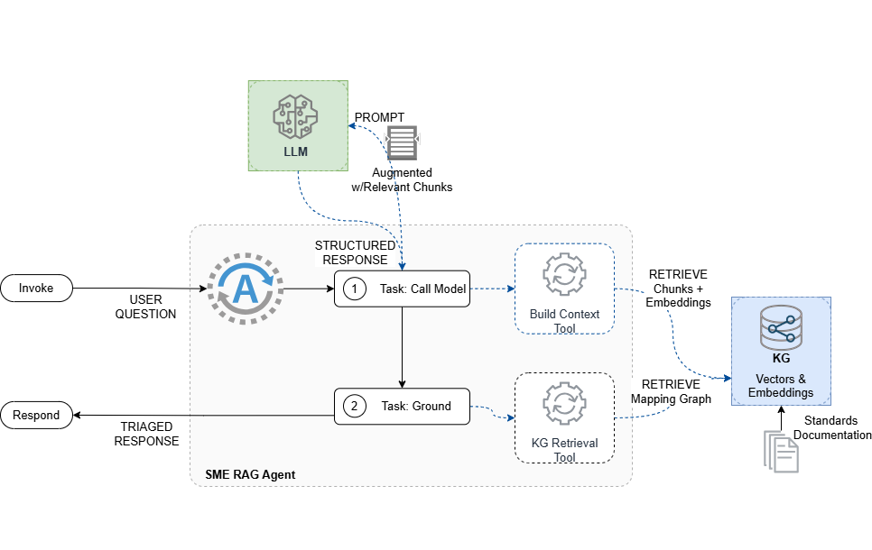

## CYBER-MAPPING-KG

A Knowledge Graph (KG) Proof-of-Concept for Cybersecurity and Privacy Standards, enabling SME-driven, agentic Reasoning and Retrieval-Augmented Generation (RAG) workflows.

---

### Overview

This project demonstrates how a standards-centric Knowledge Graph can power advanced inference and mapping tasks using both direct LLM (Language Model) and RAG-based approaches. The KG encodes controls, mappings, and embeddings for multiple cybersecurity and privacy frameworks, supporting agentic task chains for mapping, triage, and knowledge grounding.

---

### Supported Standards, Mappings and HIPAA Implementations



The KG currently includes controls and mappings for the following standards. At the core of the SME Agent KG demo, is NIST OLIR mappings for CSF versions, and HIPAA Security and Privacy Rule Implementation: NIST SP-800-66r2r2. Please refer to the corpus for published standard documentation under [./data/corpus]() for further information. For non-NIST standards i.e., CIS and SCF, we referred to the CSF 2.0 mappings published by these organizations.

| std_id | label           | title                  | type  |
|--------|-----------------|------------------------|-------|
| 10     | CIS_v8.0        | CIS Controls v8.0      | ref   |
| 20     | CSF_v1.1        | CSF v1.1               | focal |
| 30     | CSF_v2.0        | CSF v2.0               | focal |
| 40     | HIPAA_Sec-v2025 | HIPAA Security Rule    | hipaa |
| 50     | SCF_v2024       | SCF v2024.4            | ref   |

---

### Knowledge Graph Schema

The KG schema is designed to capture standards, controls, control mappings, and implementation details, including content vectors and open-ai chunk/content embeddings for semantic search.


> [!NOTE]
>
> #### Schema
>
> **Node properties**:
>
> standard {std_id: INTEGER, label: STRING, title: STRING, type: STRING}
>
> control {label: STRING, ctrlid: INTEGER, content: STRING, contentEmbeddingOpenAI: LIST}
>
> hipaaimpl {label: STRING, chunk_id: INTEGER, chunk: STRING, chunk_n: INTEGER, contentEmbeddingOpenAI: LIST}
>
> **Relationship properties**:
>
> stdcontrol {from_id: INTEGER, to_id: INTEGER}
>
> controlmap {from_id: INTEGER, to_id: INTEGER, concept_type: INTEGER, ref: STRING, hipaa: BOOLEAN, set_type: STRING}
>
> controlimpl {from_id: INTEGER, to_id: INTEGER}
>
> **The relationships**:
>
> (:standard)-[:stdcontrol]->(:control)
>
> (:control)-[:controlmap]->(:control)
>
> (:control)-[:controlimpl]->(:hipaaimpl)
>
> #### Data Location: 
>
> [Neo4J Nodes & Edges](./data/graphdb) 

------



### Agentic RAG & Inference Capabilities

The system supports the following agentic tasks:

- **Direct LLM Inference**: Uses a prompt template and LLM to answer mapping queries without retrieval augmentation.
- **RAG (Retrieval-Augmented Generation)**: Combines semantic search over KG embeddings with LLM reasoning for context-rich answers.
- **Triage & Grounding**: Compares generated mappings with grounded knowledge from the KG, supporting SME review and validation.

------

### Example CLI Usage

In all LLM cases (direct LLM, plain augmentation, extended RAG), at `temperature=0` LLM heavily relies on the given examples in the mapping and rationale generation. 

> [!TIP]
>
> Experiment with different user queries and controls to see how direct LLM response and the plain query augmentation differ only marginally, picking identical mappings with some more elaborate rationale  thanks to vector indices capturing the HIPAA Security implementation SP 800-66r2 document chunks.
>
> The last RAG demo where the query augmented with CSF 2.0 control and domain content in addition to the vector indices allows for few more mappings and a slightly richer wording of the rationale.

##### 1. Direct LLM (`--chat`)

`python main.py demo --chat GV.OC-02`

```
What are the HIPAA Security Rule sections that map to CSF 2.0's GV.OC-02?
CHAT Inference response: ```
Focal_Document_Element,Reference_Document_Element,Strength_of_relationship,Rationale
"GV.OC-02","164.308(a)(1)(ii)(B)",0.80,"Crosswalk-CSF 1.1 to HIPAA Security Rule"
"GV.OC-02","164.308(a)(5)(ii)(A)",0.75,"Crosswalk-CSF 1.1 to HIPAA Security Rule"
"GV.OC-02","164.312(a)(2)(i)",0.70,"Crosswalk-CSF 1.1 to HIPAA Security Rule"
```

##### 2. RAG Baseline (`--plain`)

`python main.py demo --rag GV.OC-02`

```
What are the HIPAA Security Rule sections that map to CSF 2.0's GV.OC-02?
RAG Inference response: 
Focal_Document_Element,Reference_Document_Element,Strength_of_relationship,Rationale
"GV.OC-02","164.308(a)(1)(ii)(B)",0.80,"Crosswalk-CSF 1.1 to HIPAA Security Rule"
"GV.OC-02","164.308(a)(5)(ii)(A)",0.75,"Conceptual relevance to security awareness and training"
"GV.OC-02","164.312(a)(2)(i)",0.70,"Prior mappings indicate relevance to access control mechanisms"
```

##### 3. Augmented RAG (`--rag`)

`python main.py demo --rag GV.OC-02`

```
What are the HIPAA Security Rule sections that map to CSF 2.0's GV.OC-02?

RAG Inference response: 
Focal_Document_Element,Reference_Document_Element,Strength_of_relationship,Rationale
"GV.OC-02","164.308(a)(1)(ii)(B)",0.80,"Crosswalk-CSF 1.1 to HIPAA Security Rule"
"GV.OC-02","164.308(a)(2)",0.75,"Conceptual alignment with security management process"
"GV.OC-02","164.312(a)(1)",0.70,"Alignment with access control implementation"
"GV.OC-02","164.316(b)(1)",0.65,"Relevance to documentation requirements"
```

> [!NOTE]
>
> Triage is where the structured response from the LLM via Augmented RAG is grounded and expanded leveraging a basic Cypher retrieval (immediate neighbors k=1) for HIPAA mappings from all KG standards & controls for the CSF 2.0 input control. Grounding stage also updates the strength of the mapping, and marks whether it was captured by both the LLM generated response and the deterministic KG inference. 
>
> In this simple implementation, the strength or level of confidence in the match for the KG retrieval depends on (1) How many other controls are mapped to the same HIPAA section, and (2) How specific the map is for the designated HIPAA section -- more specific, stronger.
>
> ```
> MATCH (c2:control {label: $csf2ctrl})<-[r1:controlmap]->(ci:control)-[r2:controlmap]->(ch:control)
> WHERE c2.ctrlid > 3000 and c2.ctrlid < 4000 AND ch.ctrlid > 4000 and ch.ctrlid < 5000
> Return c2.label as csf2, ch.label as hipaa,
> 0.7 + (count(distinct ci.ctrlid)*0.05) + ((size(split(ch.label, "("))-1)*0.025) as strength
> order by c2.label, ch.label
> ```

##### 4. Triage (`--triage`)

`python main.py demo --triage GV.OC-02`

```
What are the HIPAA Security Rule sections that map to CSF 2.0's GV.OC-02?  
```

```
Triage Inference response: {'generated_map': ```\nFocal_Document_Element,Reference_Document_Element,Strength_of_relationship,Rationale\n"GV.OC-02","164.308(a)(1)(ii)(B)",0.80,"Crosswalk-CSF 1.1 to HIPAA Security Rule"\n"GV.OC-02","164.308(a)(2)",0.75,"Conceptual alignment with security management process"\n"GV.OC-02","164.312(a)(1)",0.70,"Alignment with access control implementation"\n```', 'grounded_map':

      Focal_Document_Element Reference_Document_Element  Strength_of_relationship  Rationale                         Agreement
0     GV.OC-02               164.306(e)                  0.825                     Grounded from KB inference        No
1     GV.OC-02               164.308(a)(1)(ii)(A)        0.850                     Grounded from KB inference        No
2     GV.OC-02               164.308(a)(1)(ii)(B)        0.800                     Crosswalk-CSF 1.1 to HIPAA Security Rule        No
3     GV.OC-02               164.308(a)(2)               0.775                     Conceptual alignment with security management ...    Yes
4     GV.OC-02               164.308(a)(3)(ii)(A)        0.850                     Grounded from KB inference        No
....
13    GV.OC-02               164.312(a)(1)              0.700                      Alignment with access control implementation        No
....
21    GV.OC-02               164.314(b)(2)(iv)          0.825                      Grounded from KB inference        No}
```


------

### Extending the KG

To add new standards or mappings, update the CSVs in `data/graphdb/` and re-run the preprocessing pipeline as examplified in `src/ragprocess.py`:

`python main.py prep --reload`

------

### References
#### Standards and Frameworks
- [NIST OLIR](https://csrc.nist.gov/projects/olir/informative-reference-catalog#/)
- [NIST CSF 2.0](https://nvlpubs.nist.gov/nistpubs/CSWP/NIST.CSWP.29.pdf)
- [NIST CSF 1.1](https://nvlpubs.nist.gov/nistpubs/CSWP/NIST.CSWP.04162018.pdf)
- [NIST SP-800-66r2](https://nvlpubs.nist.gov/nistpubs/SpecialPublications/NIST.SP.800-66r2.pdf)
- [HHS HIPAA Security Rule](https://www.ecfr.gov/current/title-45/subtitle-A/subchapter-C/part-164)
- [CIS Controls v.8](https://www.cisecurity.org/controls/v8)
- [Secure Controls Framework (SCF 2025.1)](https://github.com/securecontrolsframework/securecontrolsframework)
#### Libraries and Dependencies
- [LangChain](https://github.com/langchain-ai/langchain)
- [Open AI Models](https://platform.openai.com/docs/models)
- [Neo4j](https://github.com/neo4j/neo4j)


